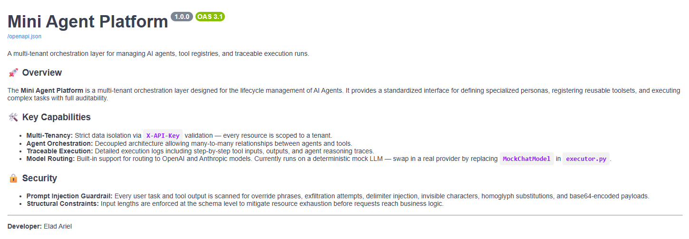

# Mini Agent Platform

A multi-tenant REST API for managing AI agents, registering tools, and running traceable task executions — built with FastAPI, MongoDB, and LangGraph.


---

## What It Does

- **Manage Tools** — Register reusable capabilities (web search, calculator, weather, etc.)
- **Manage Agents** — Create AI agents with a name, role, description, and assigned tools
- **Run Agents** — Execute an agent against a task; get back a full trace of tool calls and a final response
- **View History** — Browse paginated run history per-agent or across all agents
- **Multi-Tenancy** — Every resource is strictly scoped to a tenant via API key
- **Security Guardrails** — Prompt injection detection on both user input and tool outputs

---

## Requirements

- [Docker](https://www.docker.com/) + Docker Compose
- No Python installation needed to run the app

---

## Setup

### 1. Clone the repo

```bash
git clone https://github.com/EladAriel/mini-agent-platform.git
cd mini-agent-platform
```

### 2. Create your `.env` file

Copy `.env.example`:

```bash
cp .env.example .env
```

Edit `.env`.

> **`TENANT_API_KEYS`** is a JSON object mapping API keys to tenant IDs. Add as many tenants as you need.

### 3. Start the app

```bash
docker compose up --build
```

The API will be available at **http://localhost:8000**  
Interactive docs at **http://localhost:8000/docs**

> **Tip:** Run MongoDB and the API in separate terminals for cleaner logs:
> ```bash
> # Terminal 1
> docker compose up mongo
>
> # Terminal 2
> docker compose up api --build        # production
> docker compose up api-dev --build    # development (hot reload)
> ```

### Teardown

```bash
docker compose down -v    # stops containers and removes the mongo_data volume
```

---

## Running Tests

Tests use a real MongoDB container via Testcontainers — Docker must be running.

Create a `.env.test` file:

```env
MONGODB_APP_PASSWORD=test
MONGODB_DB=test_db
MONGODB_HOST=localhost
MAX_EXECUTION_STEPS=10
TENANT_API_KEYS={"sk-tenant-alpha-000": "tenant_alpha", "sk-tenant-beta-000": "tenant_beta"}
```

```bash
pip install -r requirements.txt
pytest
```

Or generate an HTML report:

```bash
python tests/create_test_report/run_report.py --open

# Also save the intermediate .md file (useful for git diffs)
python tests/create_test_report/run_report.py --md --open
```

---

## Development Mode

```bash
docker compose --profile dev up api-dev --build
```

## Health Check

```bash
curl http://localhost:8000/health
# {"status": "OK"}
```

---

## Documentation

| Doc | Description |
|-----|-------------|
| [architecture.md](docs/architecture.md) | System overview, Docker setup, request lifecycle |
| [api.md](docs/api.md) | All endpoints, request/response flow, error codes |
| [services.md](docs/services.md) | Business logic, executor, guardrail, mock LLM |
| [models_schemas_db.md](docs/models_schemas_db.md) | MongoDB models, Pydantic schemas, indexes |
| [quickstart_testing.md](docs/quickstart_testing.md) | Step-by-step Swagger UI testing guide |