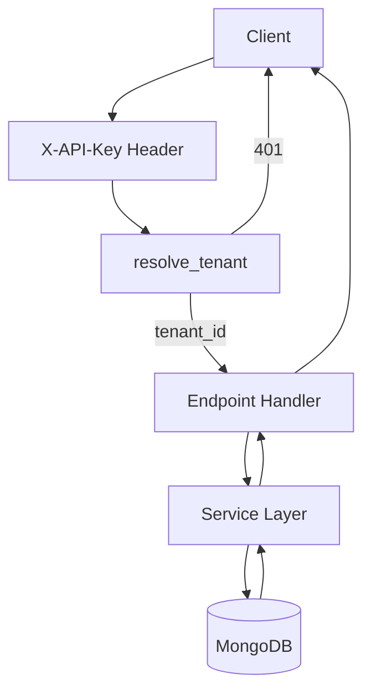
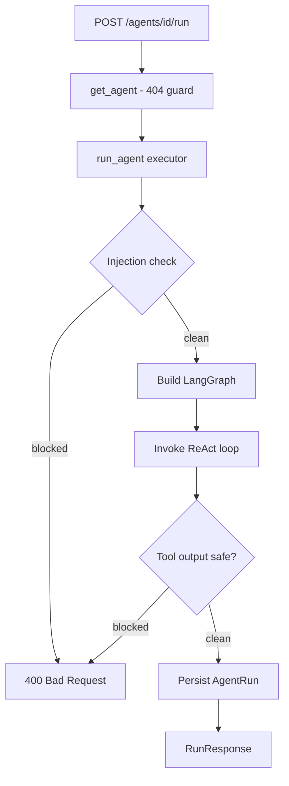

# API

The `app/api/v1/` layer defines all HTTP endpoints. Routes delegate immediately to the service layer — no business logic lives here.

---

## Structure

```
app/api/v1/
├── tools.py    # Tool CRUD endpoints
├── agents.py   # Agent CRUD + run endpoints
└── runs.py     # Global run history endpoint
```

---

## Request Flow



Every request passes through `resolve_tenant` — a FastAPI dependency that validates the API key and returns the `tenant_id`. A missing or invalid key returns **401** before any handler runs.

---

## tools.py

Base path: `/api/v1/tools`

| Method | Path | Status | Description |
|--------|------|--------|-------------|
| `POST` | `/` | 201 | Create a tool |
| `GET` | `/` | 200 | List tools; optional `?agent_name=` filter |
| `GET` | `/{tool_id}` | 200 | Get a single tool |
| `PATCH` | `/{tool_id}` | 200 | Partial update |
| `DELETE` | `/{tool_id}` | 204 | Delete a tool |

---

## agents.py

Base path: `/api/v1/agents`

| Method | Path | Status | Description |
|--------|------|--------|-------------|
| `POST` | `/` | 201 | Create an agent |
| `GET` | `/` | 200 | List agents; optional `?tool_name=` filter |
| `GET` | `/{agent_id}` | 200 | Get a single agent |
| `PATCH` | `/{agent_id}` | 200 | Partial update |
| `DELETE` | `/{agent_id}` | 204 | Delete an agent |
| `POST` | `/{agent_id}/run` | 200 | Execute agent on a task |
| `GET` | `/{agent_id}/runs` | 200 | Paginated run history for agent |

---

## runs.py

Base path: `/api/v1/runs`

| Method | Path | Status | Description |
|--------|------|--------|-------------|
| `GET` | `/` | 200 | Paginated run history across all agents |

---

## Run Endpoint Flow

The most complex endpoint — `POST /agents/{id}/run`:



---

## Pagination

`GET /agents/{id}/runs` and `GET /runs` both support:

| Param | Default | Max |
|-------|---------|-----|
| `page` | 1 | — |
| `page_size` | 20 | 100 |

Response shape:
```json
{
  "items": [...],
  "total": 42,
  "page": 1,
  "page_size": 20,
  "pages": 3
}
```

---

## Error Reference

| Code | Cause |
|------|-------|
| 401 | Missing or invalid API key |
| 400 | Prompt injection detected |
| 404 | Resource not found or belongs to another tenant |
| 422 | Validation error (bad input, unknown model, invalid tool ID) |
| 429 | LLM rate limit reached |