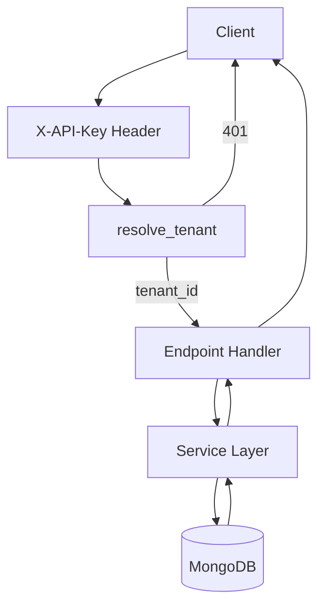
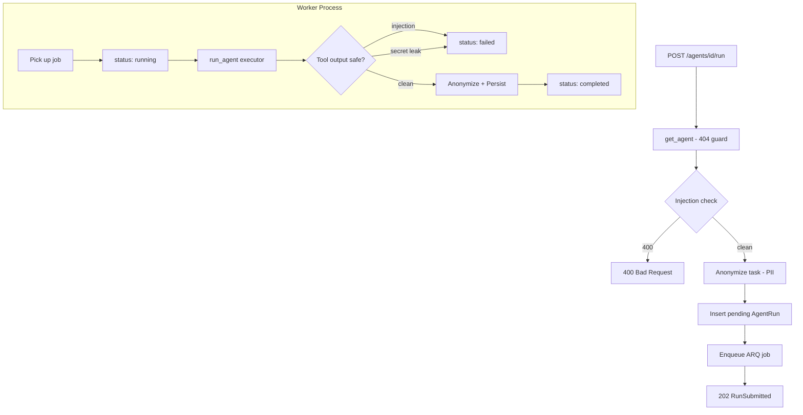

# API

The `app/api/v1/` layer defines all HTTP endpoints. Routes delegate immediately to the service layer — no business logic lives here.

---

## Structure

```text
app/api/v1/
├── tools.py    # Tool CRUD endpoints
├── agents.py   # Agent CRUD + run endpoints
└── runs.py     # Global run history endpoint
```

---

## Request Flow



Every request passes through `resolve_tenant` — a FastAPI dependency that validates the API key and returns the `tenant_id`. A missing or invalid key returns **401** before any handler runs.

---

## tools.py

Base path: `/api/v1/tools`

| Method   | Path        | Status | Description                                |
|----------|-------------|--------|--------------------------------------------|
| `POST`   | `/`         | 201    | Create a tool                              |
| `GET`    | `/`         | 200    | List tools; optional `?agent_name=` filter |
| `GET`    | `/{tool_id}`| 200    | Get a single tool                          |
| `PATCH`  | `/{tool_id}`| 200    | Partial update                             |
| `DELETE` | `/{tool_id}`| 204    | Delete a tool                              |

---

## agents.py

Base path: `/api/v1/agents`

| Method   | Path                  | Status | Description                                                    |
|----------|-----------------------|--------|----------------------------------------------------------------|
| `POST`   | `/`                   | 201    | Create an agent                                                |
| `GET`    | `/`                   | 200    | List agents; optional `?tool_name=` filter                     |
| `GET`    | `/{agent_id}`         | 200    | Get a single agent                                             |
| `PATCH`  | `/{agent_id}`         | 200    | Partial update                                                 |
| `DELETE` | `/{agent_id}`         | 204    | Delete an agent                                                |
| `POST`   | `/{agent_id}/run`     | 202    | Submit agent run (async); subject to per-tenant rate limit     |
| `GET`    | `/{agent_id}/runs`    | 200    | Paginated run history for agent                                |

---

## runs.py

Base path: `/api/v1/runs`

| Method | Path       | Status | Description                                           |
|--------|------------|--------|-------------------------------------------------------|
| `GET`  | `/{run_id}`| 200    | Get run status (poll until `completed`/`failed`)      |
| `GET`  | `/`        | 200    | Paginated run history across all agents               |

---

## Health

`GET /health` — no authentication required.

| Status | `status`   | `checks.db`   | When                                          |
|--------|------------|---------------|-----------------------------------------------|
| 200    | `ok`       | `ok`          | MongoDB ping succeeded                        |
| 503    | `degraded` | `unavailable` | Ping failed or client not initialized         |
| 429    | —          | —             | Rate limit exceeded (10/minute per client IP) |

Probes MongoDB on every call via `admin.command("ping")` with a 2-second timeout.
Orchestrators (Docker, Kubernetes) use the 503 to detect infrastructure failures.

**Rate limiting:** `GET /health` is protected by `@limiter.limit(RATE_LIMIT_HEALTH_ENDPOINT)` (default: `10/minute`), keyed by client IP. This prevents an unauthenticated attacker from exhausting MongoDB connections by hammering the endpoint. On limit breach the server returns **429 Too Many Requests** with a `Retry-After` header.

---

## Rate Limiting

`POST /agents/{agent_id}/run` is guarded by a per-tenant sliding-window rate limiter powered by `slowapi`.

- **Key**: `tenant_id` (set on `request.state` by `resolve_tenant`). Each tenant's quota is tracked independently — exhausting one tenant's limit never affects others.
- **Limit**: configurable via `RATE_LIMIT_RUN_ENDPOINT` (default: `60/minute`).
- **Backend**: Redis in production; in-memory fallback when Redis is unavailable (`in_memory_fallback_enabled=True`).

When the limit is exceeded, the server responds with **429 Too Many Requests** and the following headers:

| Header                  | Value                                      |
|-------------------------|--------------------------------------------|
| `Retry-After`           | Seconds until the window resets            |
| `X-RateLimit-Limit`     | Configured limit (e.g., `60`)              |
| `X-RateLimit-Remaining` | Requests remaining in the current window   |

Only the run submission endpoint is rate-limited. All read endpoints (`GET /agents`, `GET /runs`, etc.) are unaffected.

---

## Run Endpoint Flow

The most complex endpoint — `POST /agents/{id}/run`:



### RunSubmitted (202 body)

| Field        | Type     | Notes                                 |
|--------------|----------|---------------------------------------|
| `run_id`     | string   | Use to poll `GET /runs/{run_id}`      |
| `status`     | string   | Always `"pending"` at submission time |
| `agent_id`   | string   |                                       |
| `model`      | string   |                                       |
| `created_at` | datetime |                                       |

`task` is **intentionally absent** from this response. The anonymized task (with PII replaced by labeled placeholders) is persisted to `AgentRun.task` before the 202 is returned — ensuring neither the DB document nor any log lines ever contain raw PII. The anonymized task is available via `GET /runs/{run_id}`.

---

## Pagination

`GET /agents/{id}/runs` and `GET /runs` both support:

| Param       | Default | Max |
|-------------|---------|-----|
| `page`      | 1       | —   |
| `page_size` | 20      | 100 |

Response shape:

```json
{
  "items": [...],
  "total": 42,
  "page": 1,
  "page_size": 20,
  "pages": 3
}
```

---

## Error Reference

| Code | Cause                                                                                                                                  |
|------|----------------------------------------------------------------------------------------------------------------------------------------|
| 401  | Missing or invalid API key                                                                                                             |
| 400  | Input policy violation (prompt injection detected); detail is intentionally generic — the matched pattern is logged server-side only   |
| 404  | Resource not found or belongs to another tenant                                                                                        |
| 422  | Validation error (bad input, unknown model, invalid tool ID)                                                                           |
| 429  | Per-tenant rate limit exceeded on `POST /agents/{id}/run`; or per-IP rate limit on `GET /health`                                       |
| 500  | Tool output contained a credential leak (SecretLeakError)                                                                              |
| 503  | MongoDB unreachable (`/health` only)                                                                                                   |

---

## Security Response Headers

Every response — regardless of endpoint, status code, or whether the request was authenticated — includes these headers:

| Header                        | Value                                  | Purpose                                |
|-------------------------------|----------------------------------------|----------------------------------------|
| `X-Content-Type-Options`      | `nosniff`                              | Prevents MIME-sniffing attacks         |
| `X-Frame-Options`             | `DENY`                                 | Blocks clickjacking via iframes        |
| `Strict-Transport-Security`   | `max-age=31536000; includeSubDomains`  | HSTS — enforces HTTPS for 1 year       |
| `X-XSS-Protection`            | `0`                                    | Disables the legacy XSS filter         |

## CORS

Cross-Origin Resource Sharing is configured via `CORSMiddleware`. The allowed origins are controlled by the `CORS_ALLOWED_ORIGINS` environment variable (default: `["*"]` for development).

In production, restrict this to your actual frontend origin(s):

```env
CORS_ALLOWED_ORIGINS=https://app.example.com,https://admin.example.com
```

| Parameter           | Value                                                   |
|---------------------|---------------------------------------------------------|
| `allow_credentials` | `false` (API uses `X-API-Key`, not cookies)             |
| `allow_methods`     | `GET, POST, PATCH, DELETE`                              |
| `allow_headers`     | `X-API-Key, Content-Type`                               |
