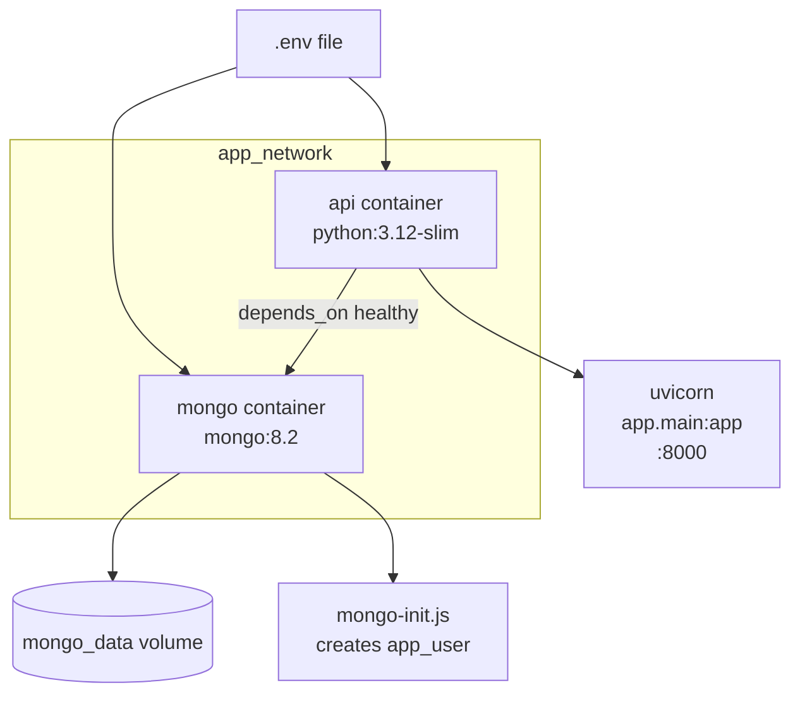
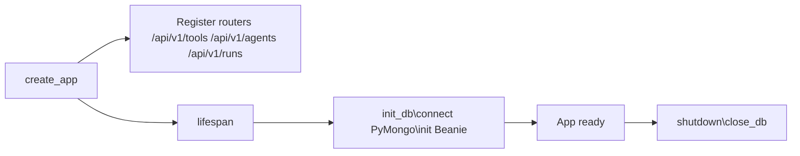
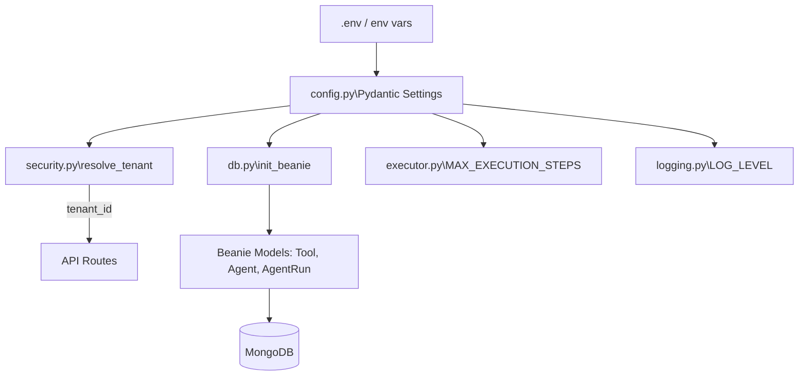
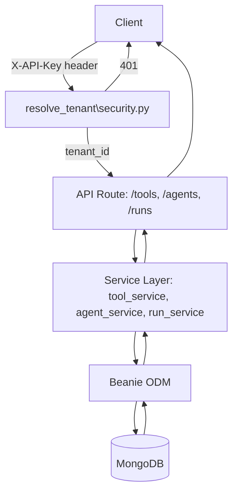
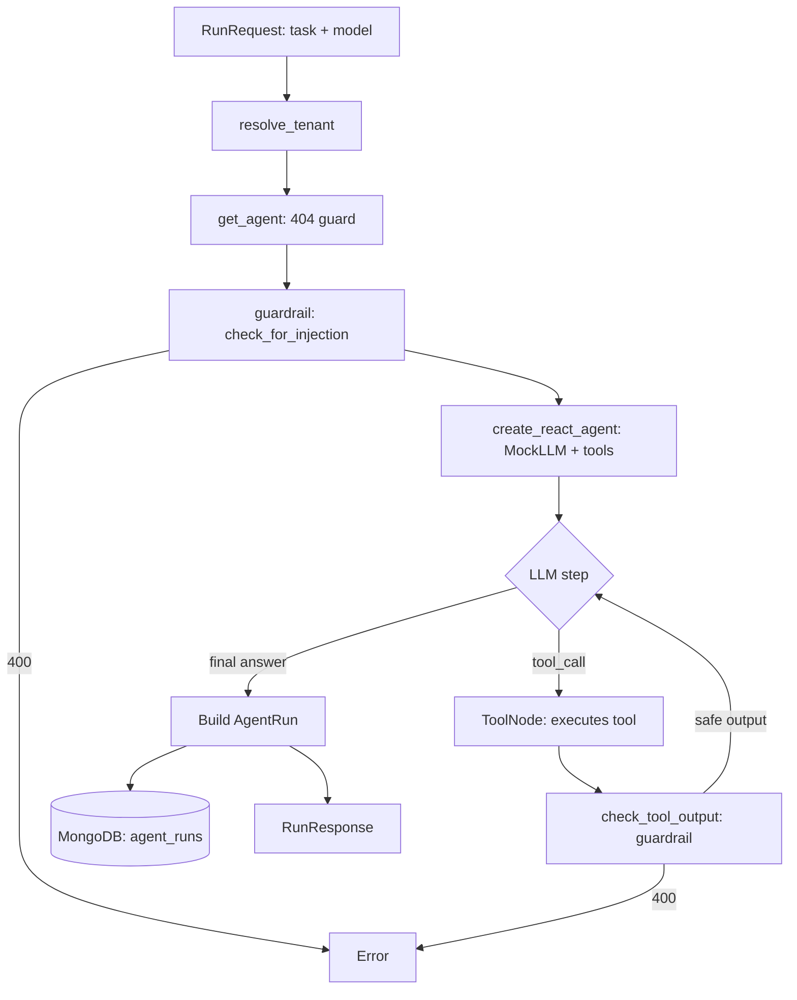

# Architecture

High-level overview of the full system — from Docker infrastructure to request handling.

---

## Docker Infrastructure

Two services share a bridge network. The API waits for MongoDB's healthcheck to pass before starting.

---

## Application Startup

`main.py` creates the FastAPI app and registers everything via a lifespan context:

---

## Core Components

`config.py` is the single source of truth for all settings — everything else reads from it.

---

## Full Request Lifecycle

---

## Agent Run Lifecycle

The most complex flow — triggered by `POST /agents/{id}/run`:

---

## Layer Summary

| Layer | Files | Responsibility |
|-------|-------|---------------|
| **Config** | `core/config.py` | Load and validate all env vars via Pydantic Settings |
| **Logging** | `core/logging.py` | Configure stdlib logging; provide `get_logger()` |
| **Security** | `core/security.py` | Validate API key → return tenant_id |
| **App entry** | `main.py` | Create FastAPI app, register routers, manage DB lifecycle |
| **API** | `api/v1/` | HTTP routing, request/response serialisation |
| **Schemas** | `schemas/` | Pydantic validation for all inputs and outputs |
| **Services** | `services/` | Business logic, DB queries, agent orchestration |
| **Models** | `models/` | Beanie ODM documents → MongoDB collections |
| **Runner** | `services/runner/` | LangGraph execution, mock LLM, tools, guardrail |