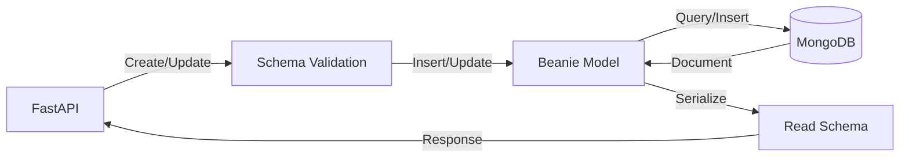
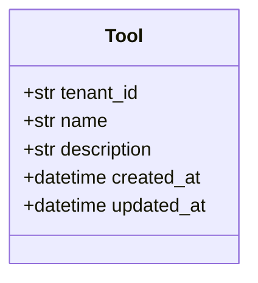
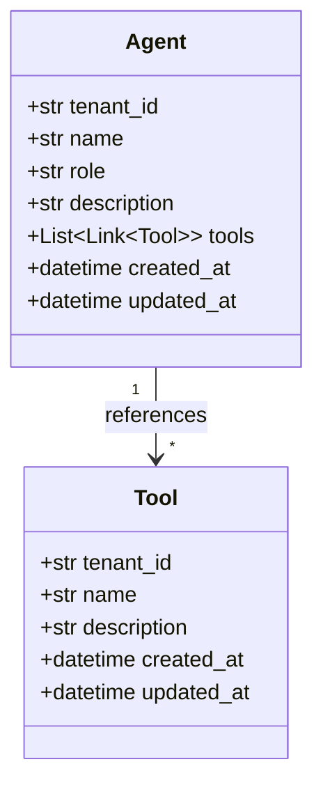
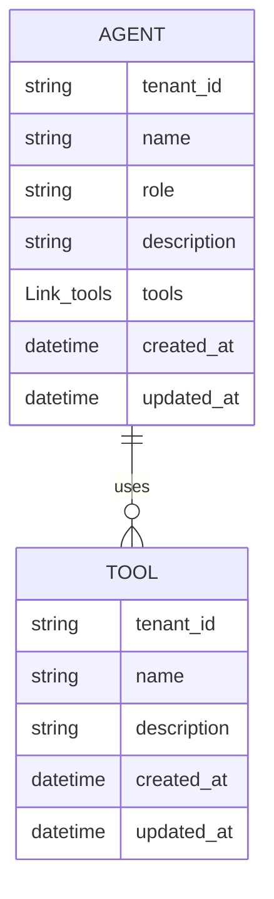
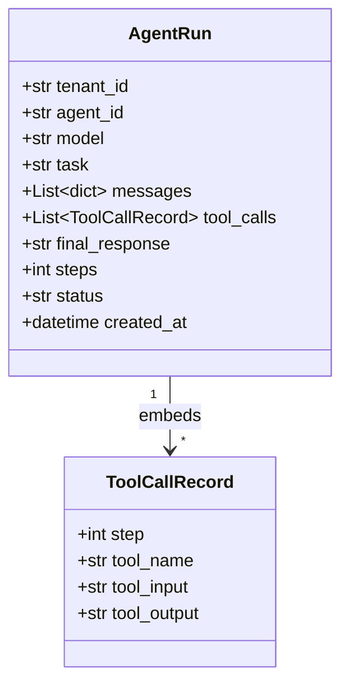
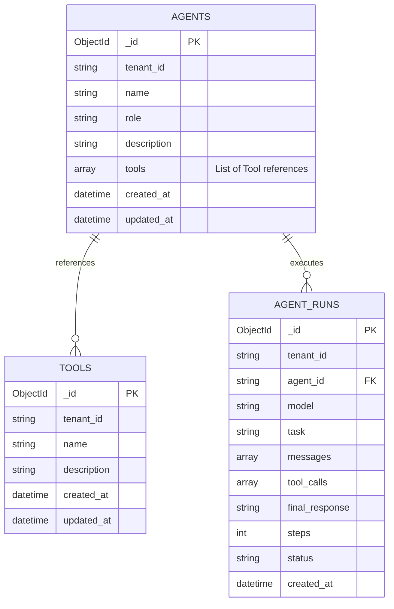
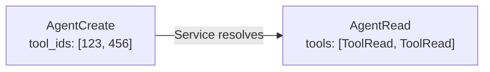
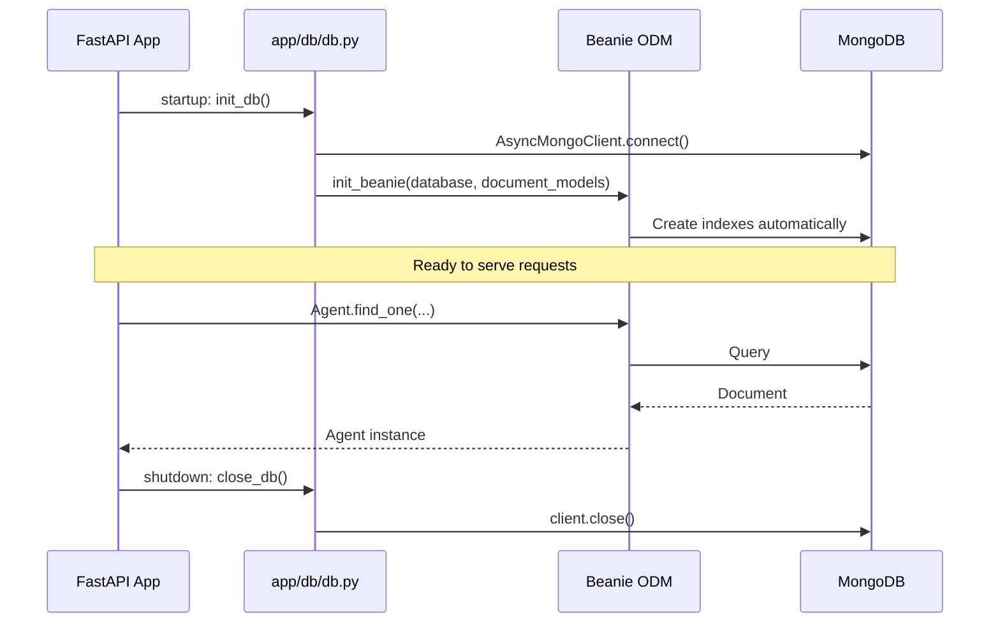
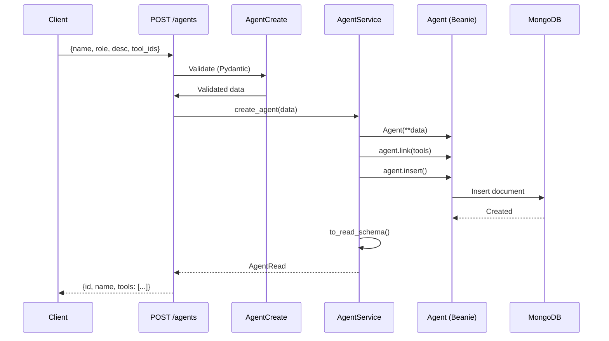
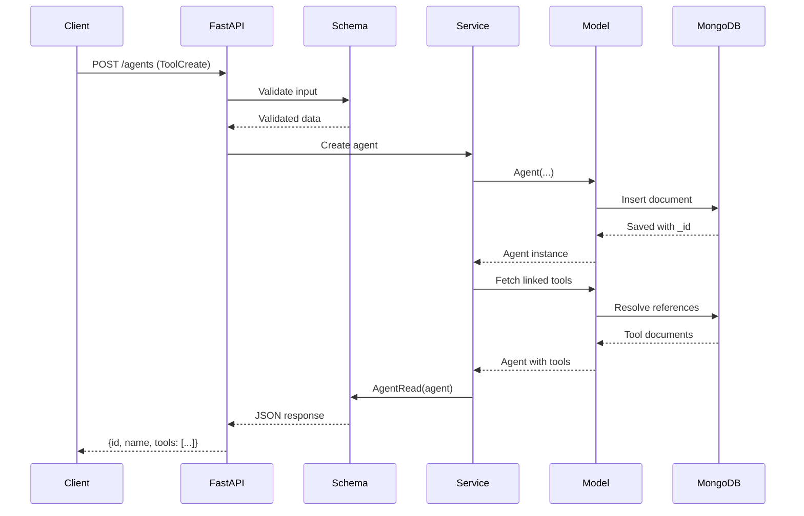

# Models, Schemas & Database

## Overview

The mini-agent-platform uses a layered architecture:

- **Models**: MongoDB documents (Beanie ODM) — database layer
- **Schemas**: Pydantic models — API validation & serialization
- **Database**: MongoDB with async PyMongo driver

---

## Models (Database Layer)

Models are Beanie `Document` classes that map directly to MongoDB collections.

Note:
- Visibility Markers Map for the class diagram:
    - (+) Public: Accessible by any other class.
    - (-) Private: Accessible only within that specific class.
    - (#) Protected: Accessible by the class and its subclasses.

- Multiplicity: indicates how many instances of one class are linked to one instance of another
    - (0..1): Zero or one.
    - (1) Exactly one.
    - (*) Many.
    - (1..*): One or many

### Tool

A reusable capability that agents can invoke.

Class Diagram:

**Collection**: `tools`
**Indexes**: `tenant_id` (for tenant-scoped queries)

---

### Agent

An AI agent with tools and configuration.

**One single agent can be associated with many tools.**

Class Diagram:

ER Diagram:

**Collection**: `agents`
**Indexes**: `tenant_id`

**Key Design:** Uses `Link[Tool]` for lazy loading - MongoDB stores only references (IDs), not full tool documents.

---

### AgentRun

Records of agent executions.

**One single execution (Run) can have many different tool calls.**

Class Diagram:

**Collection**: `agent_runs`
**Indexes**:
- `tenant_id` — tenant isolation
- `(tenant_id, agent_id)` — run history per agent
- `created_at` (desc) — chronological queries

---

## Database Collections

ER Diagram:

### Indexes

| Collection   | Index Fields                    | Purpose                         |
|--------------|---------------------------------|---------------------------------|
| agents       | `tenant_id`                     | Tenant isolation                |
| tools        | `tenant_id`                     | Tenant isolation                |
| agent_runs   | `tenant_id`                     | Tenant isolation                |
| agent_runs   | `tenant_id` + `agent_id`        | Query runs by agent             |
| agent_runs   | `created_at` (DESC)             | Sort by newest first            |

---

## Schemas (API Layer)

Schemas validate API requests and format responses. Three types per entity:

| Type | Purpose | Example |
|------|---------|---------|
| **Create** | Validate POST requests | `AgentCreate`, `ToolCreate` |
| **Read** | Format GET responses | `AgentRead`, `RunRead` |
| **Update** | Validate PATCH requests | `AgentUpdate`, `ToolUpdate` |

### Tool Schemas

| Schema      | Purpose                              | Key Fields                              |
|-------------|--------------------------------------|-----------------------------------------|
| `ToolCreate`| Create a new tool                    | `name` (required), `description`        |
| `ToolRead`  | Return tool data (includes ID)       | `id`, `name`, `description`, timestamps |
| `ToolUpdate`| Partial update (PATCH)               | Optional `name`, `description`          |

---

### Agent Schemas

| Schema        | Purpose                              | Key Fields                                           |
|---------------|--------------------------------------|------------------------------------------------------|
| `AgentCreate` | Create a new agent                   | `name`, `role`, `description`, `tool_ids`            |
| `AgentRead`   | Return agent with resolved tools     | `id`, `name`, `role`, `tools[]`, timestamps          |
| `AgentUpdate` | Partial update                       | Optional fields, `tool_ids: None` = no change, `[]` = remove all |

**Note**: `tool_ids` in Create/Update becomes `tools` in Read (IDs → resolved objects).

---

### Run Schemas

| Schema        | Purpose                              | Key Fields                                           |
|---------------|--------------------------------------|------------------------------------------------------|
| `RunRequest`  | Start agent execution                | `task`, `model` (defaults to gpt-4o)                 |
| `RunResponse` | Immediate execution result           | `run_id`, `final_response`, `tool_calls`, `steps`    |
| `RunRead`     | History view (paginated)             | Same as RunResponse + `status`                       |
| `PaginatedRuns`| List wrapper                        | `items[]`, `total`, `page`, `pages`                  |

---

## Database Connection

### Key Points

- **Beanie ODM**: Provides async MongoDB operations directly on model classes
- **Lazy Loading**: `Agent.tools` loads as references until explicitly fetched
- **Indexes**: Defined in model `Settings`, created automatically on init
- **Connection**: Managed globally, closed on app shutdown

---

## Data Flow Example

Creating an agent with tools:

### Full Request Lifecycle

---

## Supported Models

| Model             | Use Case                                      | Default |
|-------------------|-----------------------------------------------|---------|
| `gpt-4o`          | Complex multi-step reasoning, tool-heavy tasks| ✓       |
| `gpt-4o-mini`     | Fast, simple tasks (low latency)              |         |
| `claude-3-5-sonnet`| Writing, analysis, nuanced instructions      |         |
| `claude-4-5-sonnet`| Advanced reasoning, complex agent tasks      |         |

Only these models can be used in `RunRequest.model`.