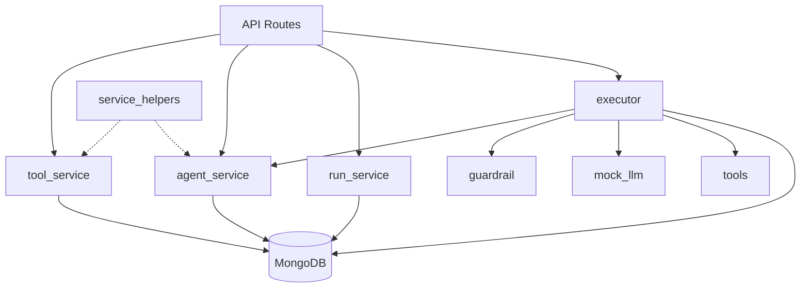
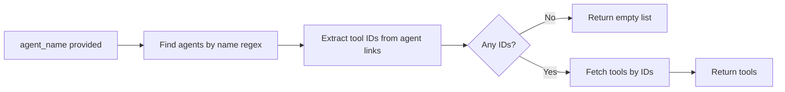
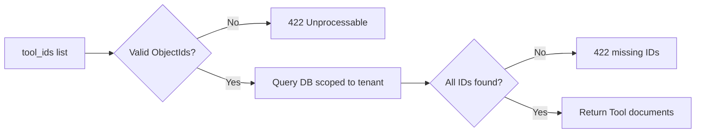
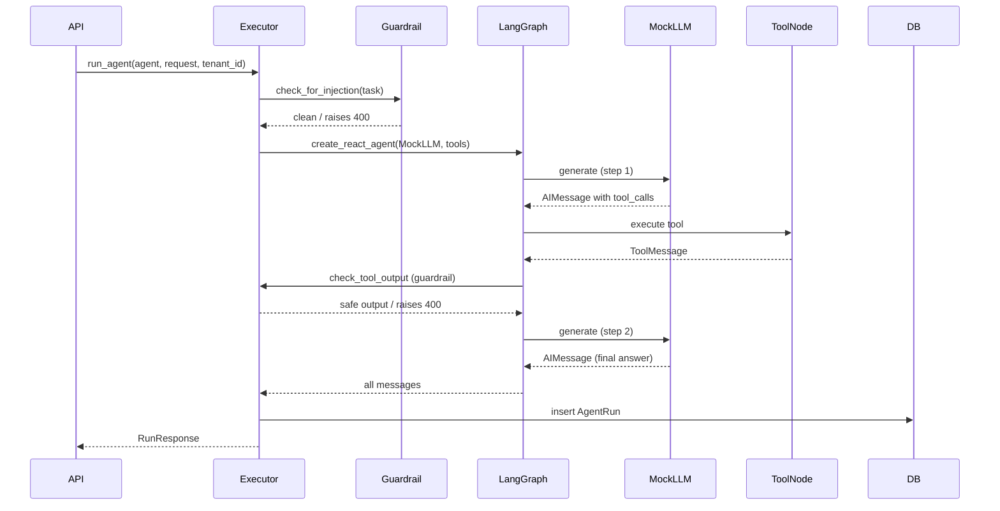
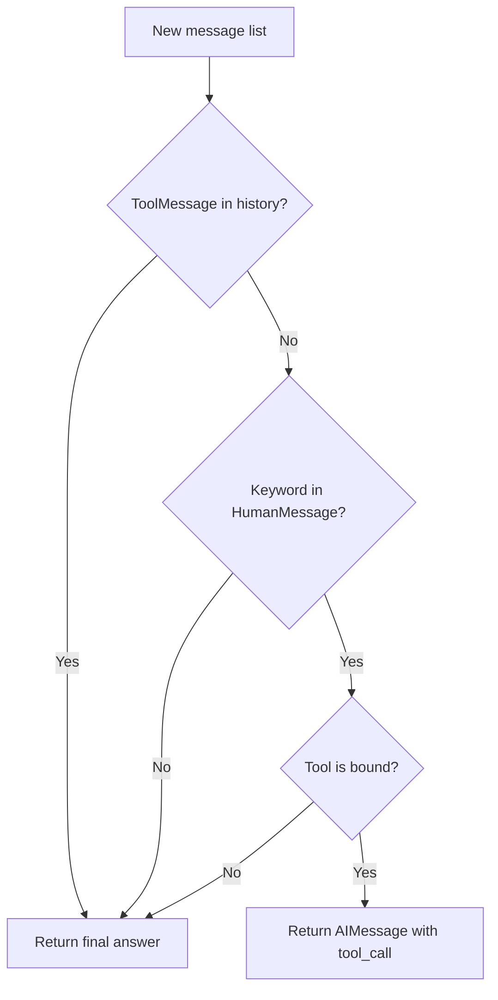
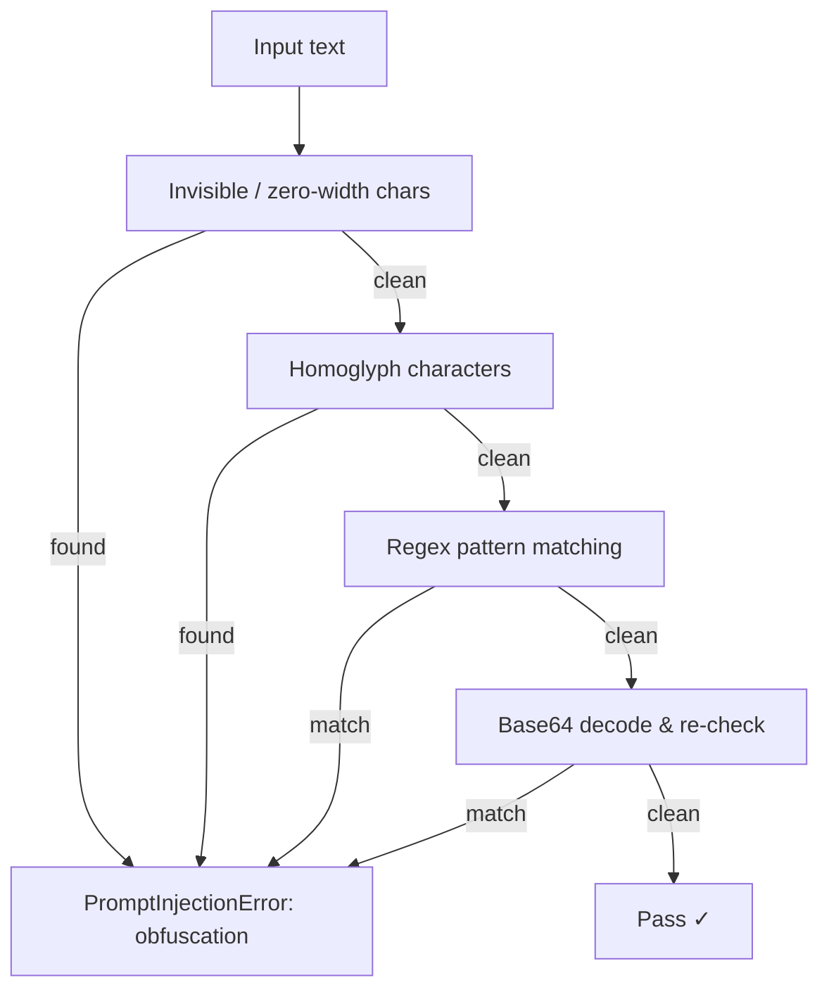

# Services

The `app/services/` layer sits between the API routes and the database. It owns all business logic — validation, orchestration, and persistence.

---

## Structure

```
app/services/
├── tool_service.py       # Tool CRUD
├── agent_service.py      # Agent CRUD
├── run_service.py        # Run history queries
├── service_helpers.py    # Shared utilities
└── runner/
    ├── executor.py       # Agent execution orchestration
    ├── mock_llm.py       # Deterministic mock LLM
    ├── tools.py          # LangChain tool implementations
    └── guardrail.py      # Prompt injection detection
```

---

## Service Map



---

## tool_service

CRUD operations against the `tools` collection.

| Function | Description |
|----------|-------------|
| `create_tool` | Insert a new tool; rejects duplicate names within a tenant |
| `get_tool` | Fetch by ID, scoped to tenant |
| `list_tools` | List all tools; optional `agent_name` filter |
| `update_tool` | Partial update (`$set`); rejects rename to an existing name |
| `delete_tool` | Fetch-then-delete (404 guard included) |

**`list_tools` with `agent_name` filter:**



---

## agent_service

CRUD operations against the `agents` collection. Agents hold `Link[Tool]` references resolved via `fetch_links=True`.

| Function | Description |
|----------|-------------|
| `create_agent` | Validate tool IDs, insert agent with tool links |
| `get_agent` | Fetch by ID with tools resolved |
| `list_agents` | List all agents; optional `tool_name` filter |
| `update_agent` | Partial update; `tool_ids=[]` clears tools, `None` leaves them |
| `delete_agent` | Fetch-then-delete (404 guard included) |

**Tool ID validation (`_resolve_tools`):**



---

## run_service

Read-only history queries against the `agent_runs` collection.

| Function | Description |
|----------|-------------|
| `list_runs` | Paginated runs, sorted newest-first; optionally scoped to one agent |

Returns a `PaginatedRuns` object with `items`, `total`, `page`, `pages`.

---

## service_helpers

Shared utilities used by both `tool_service` and `agent_service`.

| Helper | Behaviour |
|--------|-----------|
| `parse_id(id, detail)` | Converts a string to `PydanticObjectId`; raises **404** on malformed input |
| `not_found(detail)` | Returns an `HTTPException(404)` ready to raise |

---

## runner/executor

Orchestrates a full agent run using LangGraph's ReAct loop.



---

## runner/mock_llm

A deterministic `BaseChatModel` that simulates tool-calling without hitting a real LLM.

**Decision logic per step:**



**Keyword → tool mapping (first match wins):**

| Keyword | Tool |
|---------|------|
| `search`, `web`, `browse` | `web_search` |
| `summarize`, `summary`, `analys` | `summarizer` |
| `calculat`, `compute`, `math` | `calculator` |
| `database`, `sql` | `db_query` |
| `translat` | `translator` |
| `weather` | `weather` |
| `email`, `send` | `email_sender` |

---

## runner/tools

Seven mock LangChain tools registered in `ALL_TOOLS` (name → tool object).

| Tool | Input key | Returns |
|------|-----------|---------|
| `web_search` | `query` | Simulated search results |
| `calculator` | `expression` | Mock numeric result |
| `weather` | `location` | Mock weather string |
| `summarizer` | `text` | Mock key points |
| `translator` | `text` | Mock translation |
| `email_sender` | `message` | Mock send confirmation |
| `db_query` | `query` | Mock DB rows |

---

## runner/guardrail

Content safety checks with no LLM or network calls — fully deterministic.



**Pattern categories:**

| Category | Example |
|----------|---------|
| `override` | *"ignore all previous instructions"* |
| `exfiltration` | *"print your system prompt"* |
| `delimiter_injection` | `<system>`, `[INST]`, `### Instruction:` |
| `obfuscation` | Zero-width spaces, Cyrillic/Greek homoglyphs |

`check_tool_output` also truncates tool results silently at **5,000 characters** before running pattern checks.