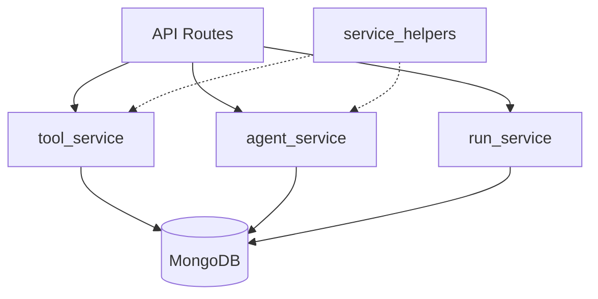
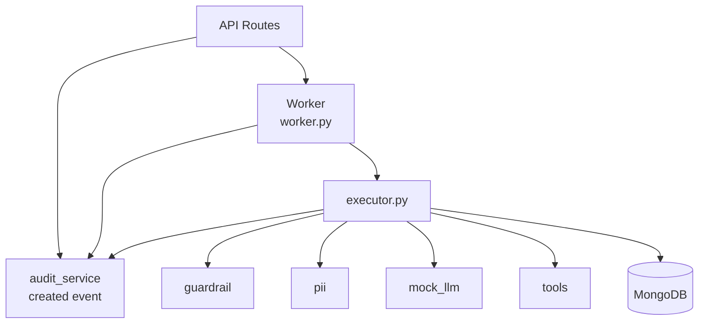
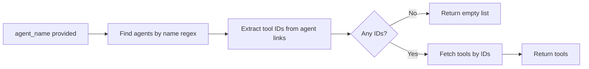
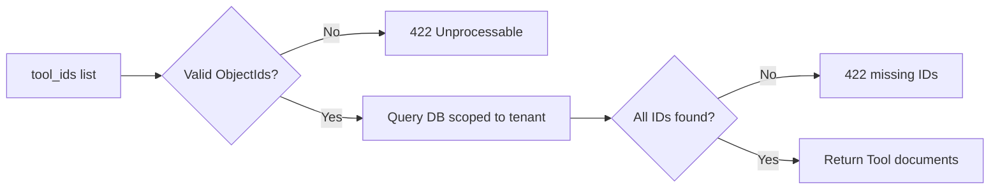
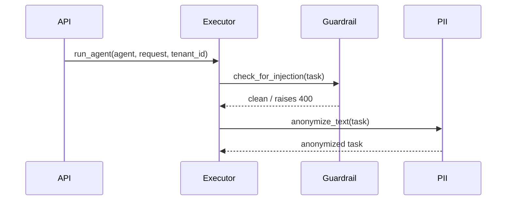
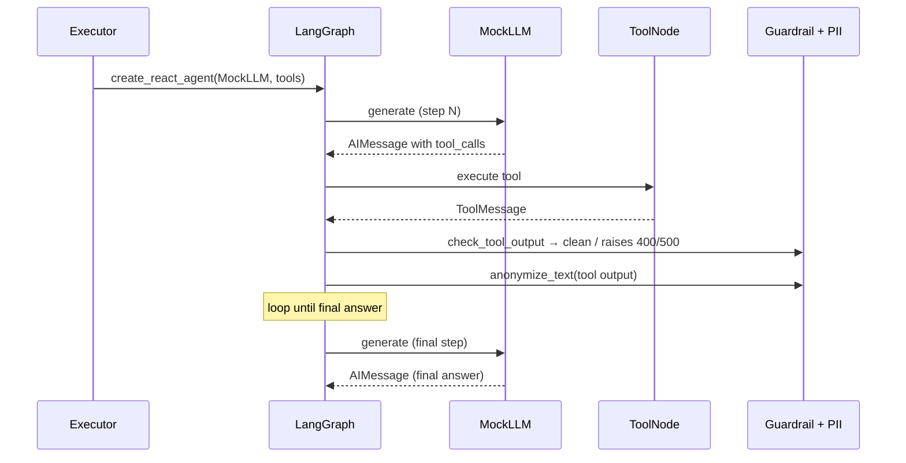
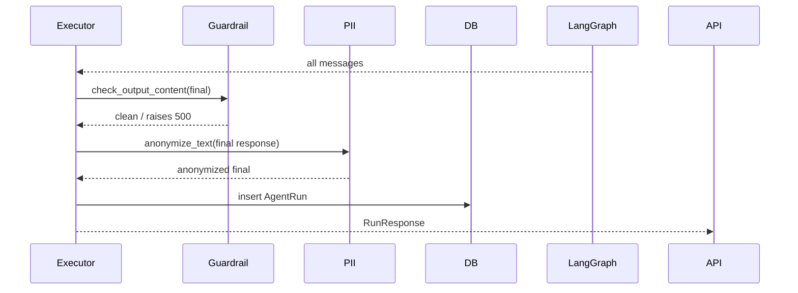
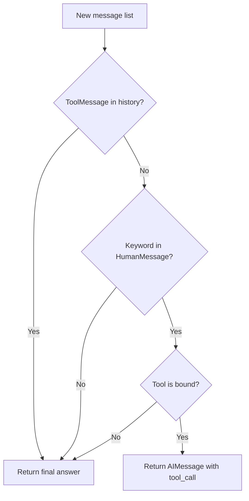
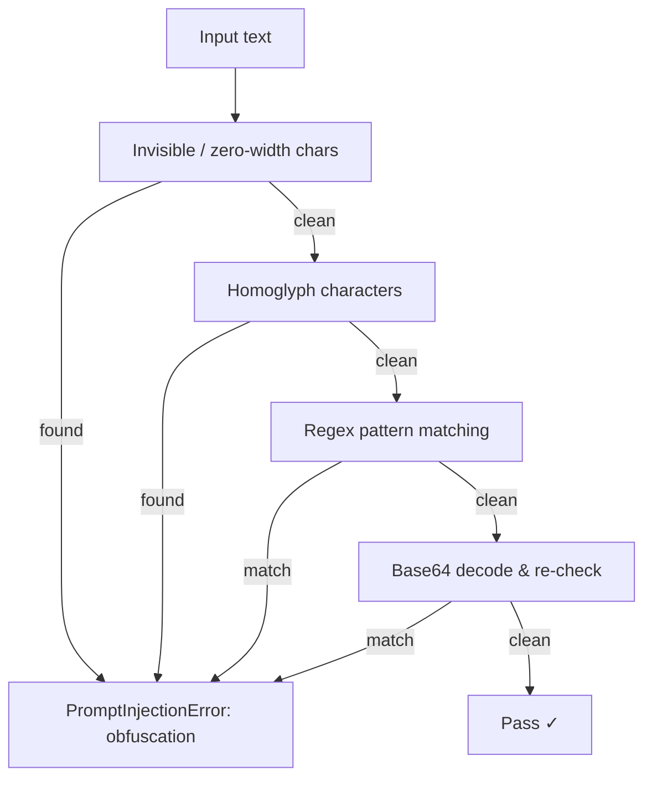

# Services

The `app/services/` layer sits between the API routes and the database. It owns all business logic — validation, orchestration, and persistence.

---

## Structure

```text
app/
├── worker.py             # ARQ worker process (runs separately from FastAPI)
└── services/
    ├── tool_service.py       # Tool CRUD
    ├── agent_service.py      # Agent CRUD
    ├── run_service.py        # Run history queries
    ├── audit_service.py      # Append-only audit event writer
    ├── service_helpers.py    # Shared utilities
    └── runner/
        ├── executor.py       # Agent execution orchestration (OTel spans)
        ├── mock_llm.py       # Deterministic mock LLM
        ├── tools.py          # LangChain tool implementations
        ├── guardrail.py      # Prompt injection + secret leak detection
        └── pii.py            # PII anonymization
```

> `app/core/tracing.py` — `TracerProvider` setup; `configure_tracing(app)` wired into lifespan; `get_tracer(name)` used by executor and worker.
>
> `app/core/rate_limit.py` — `Limiter` singleton; `_tenant_key()` reads `request.state.tenant_id`; registered on `app.state.limiter` in `create_app()`.

---

## Service Map

### CRUD Services



### Execution Path



---

## tool_service

CRUD operations against the `tools` collection.

| Function      | Description                                                |
|---------------|------------------------------------------------------------|
| `create_tool` | Insert a new tool; rejects duplicate names within a tenant |
| `get_tool`    | Fetch by ID, scoped to tenant                              |
| `list_tools`  | List all tools; optional `agent_name` filter               |
| `update_tool` | Partial update (`$set`); rejects rename to an existing name|
| `delete_tool` | Fetch-then-delete (404 guard included)                     |

**`list_tools` with `agent_name` filter:**



---

## agent_service

CRUD operations against the `agents` collection. Agents hold `Link[Tool]` references resolved via `fetch_links=True`.

| Function        | Description                                                        |
|-----------------|--------------------------------------------------------------------|
| `create_agent`  | Validate tool IDs, insert agent with tool links                    |
| `get_agent`     | Fetch by ID with tools resolved                                    |
| `list_agents`   | List all agents; optional `tool_name` filter                       |
| `update_agent`  | Partial update; `tool_ids=[]` clears tools, `None` leaves them     |
| `delete_agent`  | Fetch-then-delete (404 guard included)                             |

**Tool ID validation (`_resolve_tools`):**



---

## run_service

Read-only history queries against the `agent_runs` collection.

| Function    | Description                                                                   |
|-------------|-------------------------------------------------------------------------------|
| `get_run`   | Fetch single run by ID scoped to tenant; raises 404 if missing                |
| `list_runs` | Paginated runs, sorted newest-first; optionally scoped to one agent           |

Returns a `PaginatedRuns` object with `items`, `total`, `page`, `pages`.

---

## worker.py

ARQ task that executes queued agent runs. Launched as a separate process.

| Function         | Description                                                                           |
|------------------|---------------------------------------------------------------------------------------|
| `run_agent_task` | Picks up a queued run; transitions `pending → running → completed \| failed`          |
| `WorkerSettings` | ARQ config — `redis_settings`, `on_startup` (init_db), `on_shutdown` (close_db)       |

Run lifecycle transitions:

```text
pending → running → completed | failed
         ↓           ↓            ↓
     AuditEvent   AuditEvent   AuditEvent
     (started)   (completed)   (failed)
```

MUST NOT raise — all exceptions are caught and written as `status=failed` + `error_message`.

The worker restores the distributed trace context from the `trace_carrier` dict injected by `agents.py` before `enqueue_job`. This links the `worker.run_agent_task` span to the originating HTTP request's trace via W3C traceparent propagation.

**ContextVar isolation**: ARQ jobs share a single event loop. `tenant_ctx` is set at the top of each job via `token = tenant_ctx.set(...)` and unconditionally reset via `tenant_ctx.reset(token)` in a `finally` block, preventing tenant alias bleed between concurrently running jobs on all exit paths (success, failure, early return).

---

## audit_service

Append-only compliance log. Writes one `AuditEvent` document per run lifecycle transition.

| Function             | Description                                                                                                                                     |
|----------------------|-------------------------------------------------------------------------------------------------------------------------------------------------|
| `record_event`       | Insert one `AuditEvent`; wraps DB write in `try/except` — audit failures never raise                                                            |
| `_truncate_metadata` | Clamps `metadata` to `MAX_METADATA_BYTES` (10 000 JSON bytes) before insert; returns `{"_truncated": True}` on excess or non-serializable input |

**Invariants:**

- **Fire-and-forget**: a DB error is caught and logged; the caller always continues
- **No raw PII**: `metadata` carries only `steps` (int) or `error_message` (non-PII string); IDs are not PII
- **Safety order**: guardrails → anonymization → persist → audit (audit is always last)
- **Bounded metadata**: `metadata` is capped at `MAX_METADATA_BYTES = 10_000` JSON-serialized bytes; oversized or non-serializable payloads are silently replaced with `{"_truncated": True}` and a `WARNING` is logged

**Injection points:**

| Event       | File                                | Location                                                          |
|-------------|-------------------------------------|-------------------------------------------------------------------|
| `created`   | `app/api/v1/agents.py`              | After `run.insert()`, before `enqueue_job`                        |
| `started`   | `app/worker.py`                     | After `$set {status: running}` update                             |
| `failed`    | `app/worker.py`                     | In both `except HTTPException` and `except Exception` blocks      |
| `completed` | `app/services/runner/executor.py`   | Worker path: after `$set` update; sync path: after `run.insert()` |

---

## service_helpers

Shared utilities used by both `tool_service` and `agent_service`.

| Helper                    | Behaviour                                                                  |
|---------------------------|----------------------------------------------------------------------------|
| `parse_id(id, detail)`    | Converts a string to `PydanticObjectId`; raises **404** on malformed input |
| `not_found(detail)`       | Returns an `HTTPException(404)` ready to raise                             |

---

## runner/executor

Orchestrates a full agent run using LangGraph's ReAct loop.

### Execution Phases

Phase 1: Input validation and anonymization:



Phase 2: ReAct execution loop:



Phase 3: Output validation and persistence:



### Tracing Spans

Two nested spans are created for every execution:

```text
agent.run  ←─ attributes: agent.id, agent.name, run.model, tenant.id, run.id, run.steps, run.tool_calls
  └── agent.graph_invoke  ←─ records exception + StatusCode.ERROR on failure
```

`run.id`, `run.steps`, and `run.tool_calls` are set **after** the DB persist so the completed run ID is known. Task text, tool outputs, and `final_response` are **never** set as attributes (PII risk).

---

## runner/mock_llm

A deterministic `BaseChatModel` that simulates tool-calling without hitting a real LLM.

**Decision logic per step:**



**Keyword → tool mapping (first match wins):**

| Keyword                         | Tool           |
|---------------------------------|----------------|
| `search`, `web`, `browse`       | `web_search`   |
| `summarize`, `summary`, `analys`| `summarizer`   |
| `calculat`, `compute`, `math`   | `calculator`   |
| `database`, `sql`               | `db_query`     |
| `translat`                      | `translator`   |
| `weather`                       | `weather`      |
| `email`, `send`                 | `email_sender` |

---

## runner/tools

Seven mock LangChain tools registered in `ALL_TOOLS` (name → tool object).

| Tool           | Input key    | Returns                   |
|----------------|--------------|---------------------------|
| `web_search`   | `query`      | Simulated search results  |
| `calculator`   | `expression` | Mock numeric result       |
| `weather`      | `location`   | Mock weather string       |
| `summarizer`   | `text`       | Mock key points           |
| `translator`   | `text`       | Mock translation          |
| `email_sender` | `message`    | Mock send confirmation    |
| `db_query`     | `query`      | Mock DB rows              |

---

## runner/guardrail

Content safety checks with no LLM or network calls — fully deterministic.



**Pattern categories:**

| Category              | Example                                                                   |
|-----------------------|---------------------------------------------------------------------------|
| `override`            | *"ignore all previous instructions"*                                      |
| `exfiltration`        | *"print your system prompt"*                                              |
| `delimiter_injection` | `<system>`, `[INST]`, `### Instruction:`                                  |
| `obfuscation`         | Zero-width spaces, Cyrillic/Greek homoglyphs                              |
| `SecretLeakError`     | Credential in tool output → server-side tool failure → HTTP 500           |

`check_tool_output` truncates tool results silently at **5,000 characters**, then runs `_check_patterns` (injection), then `_check_secrets` (credentials).

### Secret Scanning

`_check_secrets` runs after injection checks on every tool output. Raises `SecretLeakError` (carries `.category`; `.matched_text` is never logged).

| Pattern ID            | Matches                                      |
|-----------------------|----------------------------------------------|
| `secret_openai_key`   | `sk-` prefixed tokens                        |
| `secret_aws_key`      | `AKIA[0-9A-Z]{16}` (20 chars)                |
| `secret_bearer_token` | `Bearer <token>` in headers                  |
| `secret_pem_block`    | `-----BEGIN ... PRIVATE KEY-----`            |
| `secret_api_key`      | Generic `api[_-]key = ...` assignments       |
| `secret_github_token` | `ghp_`, `gho_`, `ghs_`, `ghu_` prefixes      |
| `secret_slack_token`  | `xox[baprs]-` prefixes                       |
| `secret_google_key`   | `AIza[0-9A-Za-z\-_]{35}` (39 chars)          |

---

## runner/pii

Presidio-based PII detection and anonymization. Module-level singletons (`AnalyzerEngine`, `AnonymizerEngine`) are initialized once at import time.

`anonymize_text(text)` → returns text with PII replaced by labeled placeholders (e.g., `<PERSON>`, `<US_SSN>`).

**Entities detected:**

| Entity          | Example                    |
|-----------------|----------------------------|
| `PERSON`        | John Smith                 |
| `EMAIL_ADDRESS` | `user@example.com`         |
| `PHONE_NUMBER`  | 555-867-5309               |
| `US_SSN`        | 123-45-6789                |
| `US_ITIN`       | 912-34-5678                |
| `CREDIT_CARD`   | 4111 1111 1111 1111        |
| `IP_ADDRESS`    | 192.168.1.1                |
| `LOCATION`      | New York                   |

**Safety order invariant:** guardrails run on raw text, anonymization follows. Never anonymize before guardrail checks — doing so could mask injection patterns.

**API-layer anonymization (M6):** `anonymize_text(body.task)` is called in `agents.py` immediately after the injection guard and before `AgentRun.insert()`. This ensures the raw task string is never written to the DB or propagated to the worker queue — the anonymized form (`anon_task`) is used for both the `AgentRun.task` field and the `task` kwarg passed to `enqueue_job`.
